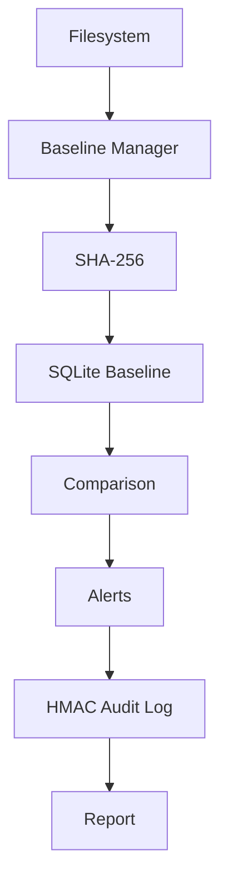
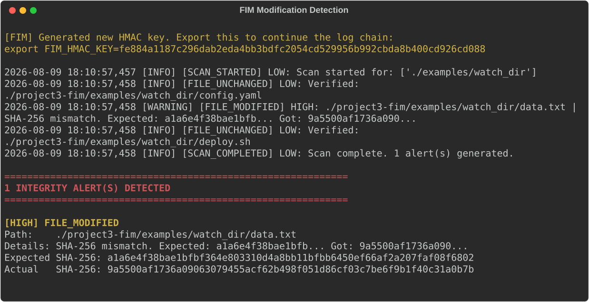
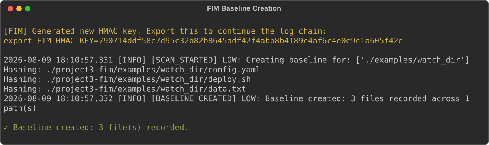

# File Integrity Monitor

Defensive File Integrity Monitoring system using SHA-256 baselines and chained HMAC audit logging.

**Security Domain:** Host Security / Integrity Monitoring
**Language:** Python 3.9
**Testing:** 44 automated tests (100% passing)
**Scope:** Host Filesystem

---

## Key Capabilities

| Capability | Description |
|---|---|
| SHA-256 Fingerprinting | Calculates cryptographic hashes of files to establish content integrity baselines. |
| State Comparison | Detects unauthorized file creation, modification, and deletion events. |
| SQLite Baselines | Persistently tracks known-good states and metadata. |
| HMAC Audit Logging | Creates a tamper-evident audit trail by chaining HMAC-SHA256 signatures. |
| Configurable Exclusions | Avoids false positives by dynamically excluding safe, volatile directories. |

## Architecture



## Demonstration



*FIM scan detecting an unauthorized modification to a monitored file (SHA-256 mismatch).*



*Initial generation of the cryptographic file baseline.*

## Technical Approach
The FIM establishes a known-good SQLite baseline using SHA-256 hashing. During monitoring intervals, it evaluates the filesystem against this baseline, flagging modifications solely on cryptographic hash mismatches (ignoring trivial mtime metadata changes). To prevent attackers from covering their tracks, all alerts are logged using a chained HMAC mechanism, rendering the audit log tamper-evident.

## Testing
Rigorous suite of 44 tests validating hash correctness, baseline persistence, detection of all CRUD file operations, and the mathematical integrity of the HMAC chain.

## Quick Start
```bash
python3 -m venv .venv
source .venv/bin/activate
pip install -r requirements.txt
python3 -m src.fim --baseline --config config/fim_config.yaml
python3 -m src.fim --monitor --config config/fim_config.yaml
```

## Security Considerations
SHA-256 serves as a content integrity fingerprint. The HMAC implementation relies on an educational/local environment variable (`FIM_HMAC_KEY`) for trust. A production deployment would require KMS/HSM-backed key management and remote protected logging to fully defend against root-level adversaries.

## Limitations
Polling-based monitoring implies a detection delay based on the interval schedule, distinguishing it from kernel-level real-time inotify solutions.

## Interview Guide
[View INTERVIEW.md](INTERVIEW.md)
